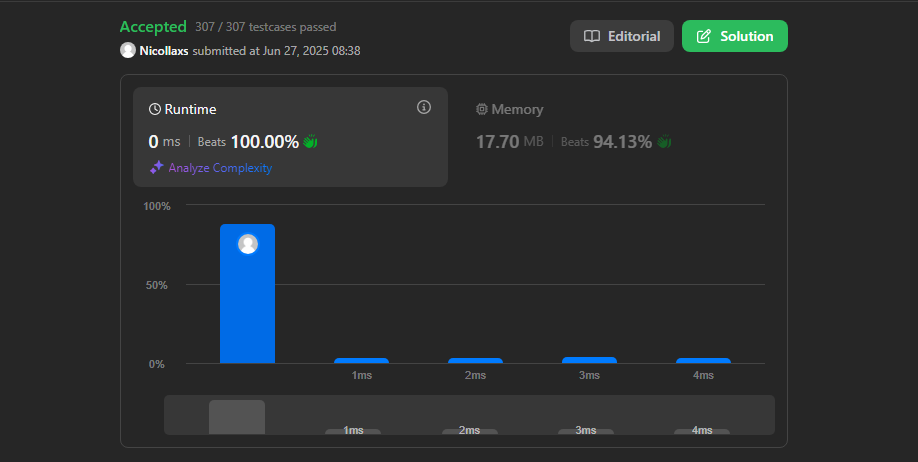
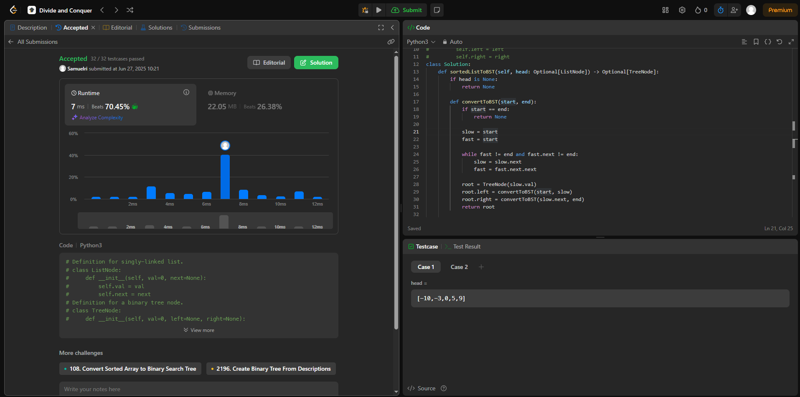
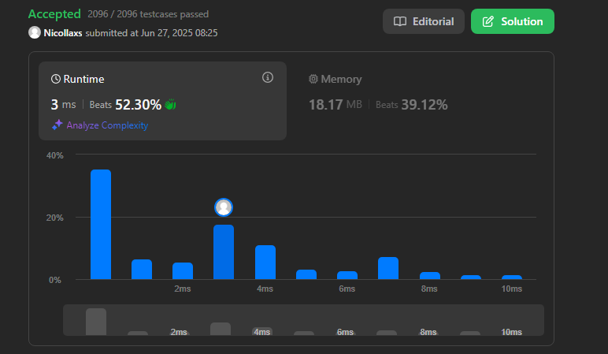
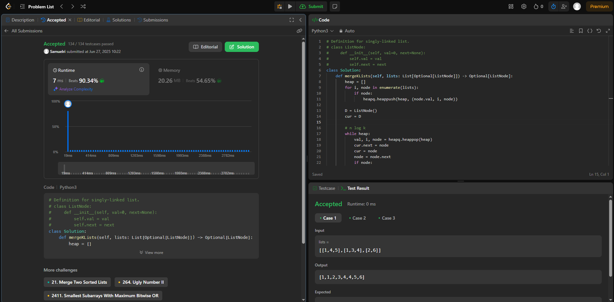

# DC_Nicollas_e_Samuel

**Conteúdo da Disciplina:** Dividir e Conquistar

---

## 👨‍🎓 Alunos

| Matrícula   | Aluno                                               |
|-------------|-----------------------------------------------------|
| 211062802   | Nicollas Gabriel Oliveira Sousa                   |
| 211031486   | Samuel Ribeiro da Costa                |

---

## 📌 Sobre

## 🧠 Questões Desenvolvidas

A dupla desenvolveu quatro questões, considerando o nível de dificuldade: duas de complexidade média e duas de maior dificuldade.

1. [POW](https://leetcode.com/problems/powx-n/)- Nível Médio
2. [convert sorted](https://leetcode.com/problems/convert-sorted-list-to-binary-search-tree/?envType=problem-list-v2&envId=divide-and-conquer) - Nível Médio
3. [Median of Two Sorted Arrays](https://leetcode.com/problems/median-of-two-sorted-arrays/)- Nível Difícil
4. [marger k sorted lists](https://leetcode.com/problems/merge-k-sorted-lists/description/) - Nível Difícil


---

## 📸 Screenshots

### ✅ Accepted Pow (DIVIDIR E CONQUISTAR)



<br>

### ✅ Accepted convert sorted



### ✅ Accepted Median of Two Sorted Arrays



## ✅ Accepted marger k sorted lists





## 🎥 Vídeo de Apresentação

Neste vídeo, apresentamos um resumo completo do trabalho desenvolvido, abordando os principais pontos discutidos ao longo do projeto.

[Assista no YouTube](https://youtu.be/xBe4Fc-8cew)

---
## ⚙️ Instalação

**Linguagem:** Python 3.*


### Pré-requisitos

Python 3 instalado no sistema. 

### Como rodar

Clone o Repositório
```bash
git clone https://github.com/projeto-de-algoritmos-2025/DC_Nicollas_e_Samuel.git
```
<br>

Navegue até a pasta principal
```bash
cd seuRepositorio/DC_Nicollas_e_Samuel
```
<br>

Escolha qual código você deseja testar e rode
```bash
python3 nome_do_arquivo.py
```
